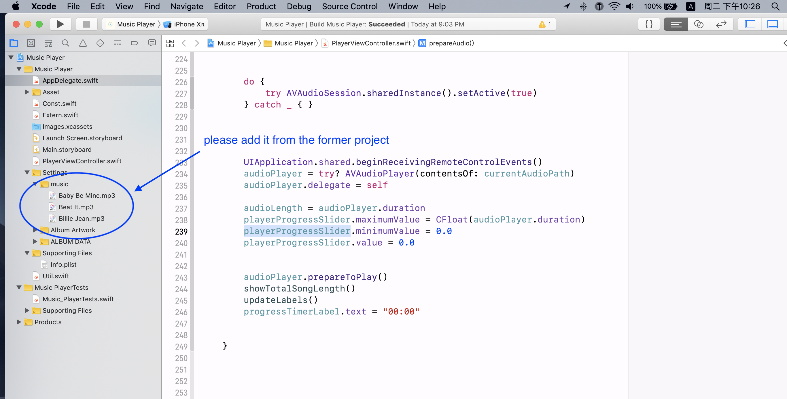

# mPlayer
bpolat/Music-Player, updates to Swift 5

博客地址： [开发一款 iOS 音乐播放器的五个点](https://juejin.im/post/5d596257f265da03ae7873da)

完整版镜像：[含有资源的 repo，直接跑](https://dev.tencent.com/u/dengjiangzhou/p/Obj_C_launch/git/tree/mPlayer)

### please add the music files to play , from the [former project](https://github.com/bpolat/Music-Player)， or your own source

请添加 mp3 文件来播放，可以从原来的仓库，也可以用自己的文件

bpolat/Music-Player, updates to Swift 5

把 bpolat 的 Music-Player，升级到  Swift 5

